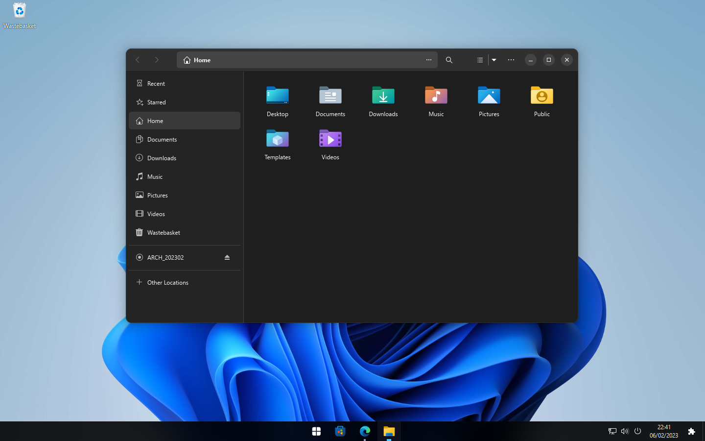

# Windows 10/11 appearance for GNOME
My personal configuration for GNOME.

Install [adw-gtk3](https://github.com/lassekongo83/adw-gtk3) 'Legacy Applications' theme.

Gnome Shell Extensions List:
- [ArcMenu](https://extensions.gnome.org/extension/3628/arcmenu/)
- [Blur my Shell](https://extensions.gnome.org/extension/3193/blur-my-shell/)
- [Dash to Panel](https://extensions.gnome.org/extension/1160/dash-to-panel/)
- [Date Menu Formatter](https://extensions.gnome.org/extension/4655/date-menu-formatter/)
  - kk:mm\ndd/MM/y
- [Desktop Icons](https://extensions.gnome.org/extension/4337/desktop-icons-neo/)
- [Extension List](https://extensions.gnome.org/extension/3088/extension-list/) _Optional._
- [Quick Settings Tweaker](https://extensions.gnome.org/extension/5446/quick-settings-tweaker/) _Change the settings to your liking._
- [Rounded Window Corners](https://extensions.gnome.org/extension/5237/rounded-window-corners/)
- [User Themes](https://extensions.gnome.org/extension/19/user-themes/)

Cursor and Icon Theme:
- [Windows 10 Cursor](https://github.com/yeyushengfan258/We10XOS-cursors)
- [Windows 11 Icons](https://github.com/yeyushengfan258/Win11-icon-theme)

Place the 'Windows' folder inside ~/.themes and load it through Tweaks.
  
[Segoe UI Font](https://drive.google.com/file/d/1WysnQNGr37ml1elWO_1YqxArjKgwUYbx/view)

Make sure to set Font Antialiasing to Subpixel and Hinting to full.

# Previews:

